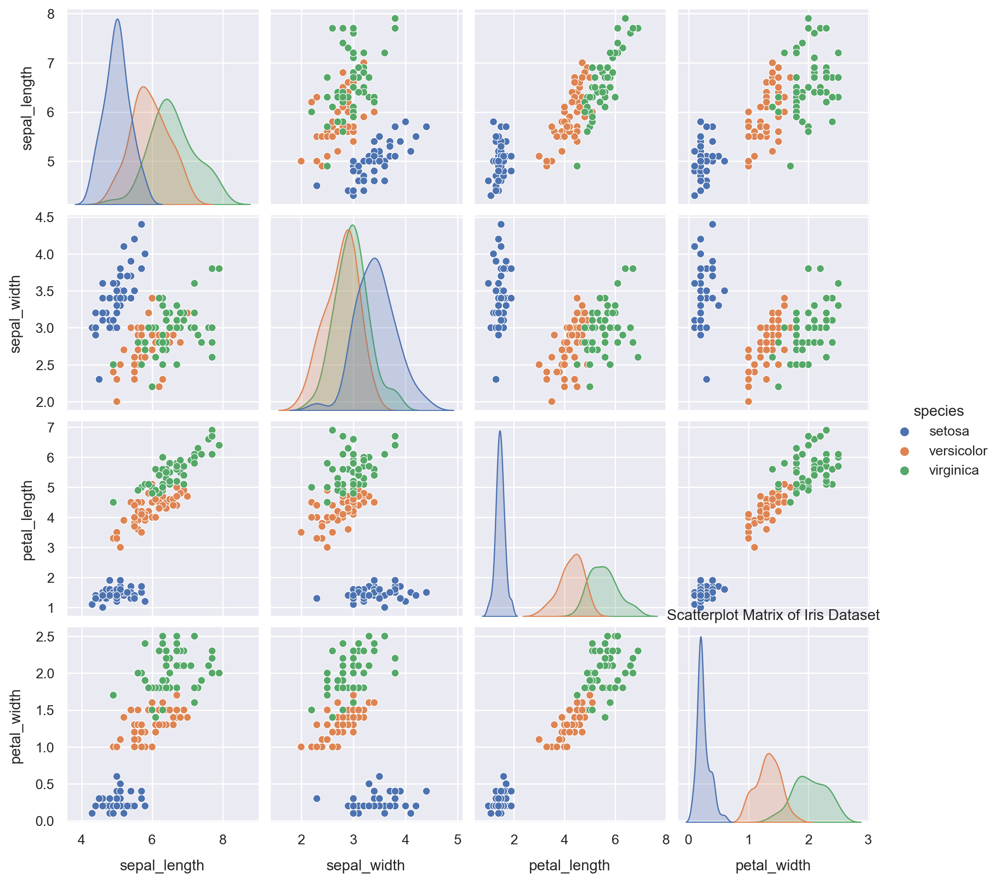
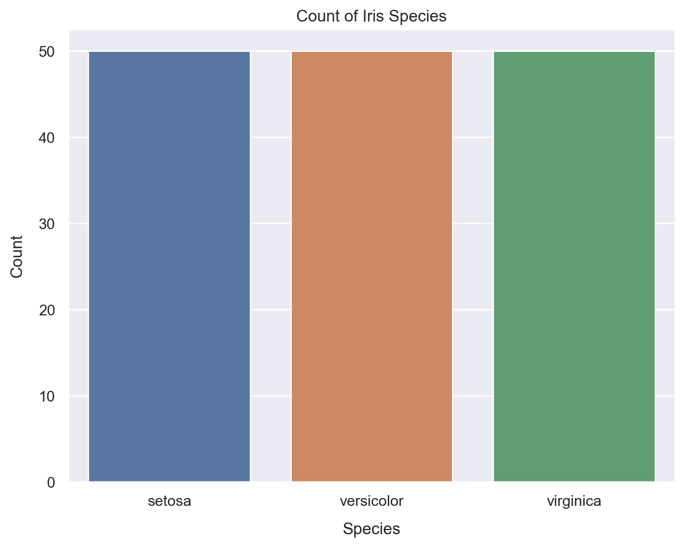
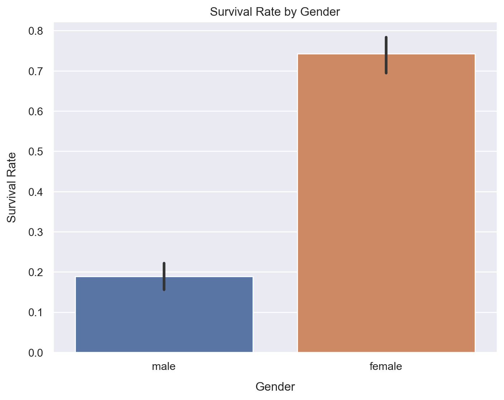
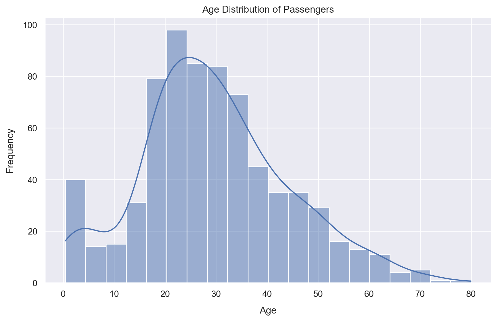
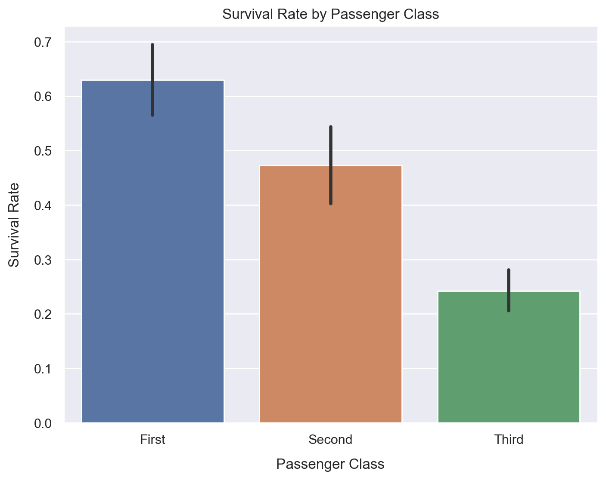
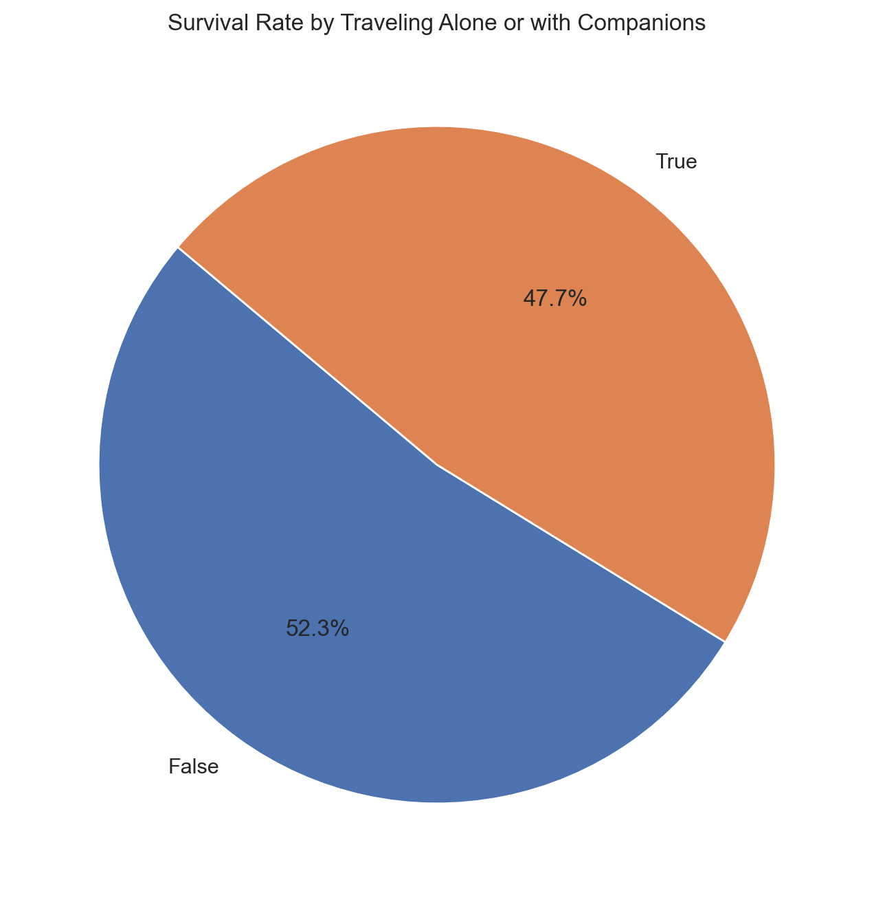

# Exploration of Iris and Titanic Datasets  

Welcome to the **Exploration of Iris and Titanic Datasets** repository. This project focuses on analyzing two widely studied datasets—**Iris** and **Titanic**—to explore and compare visualization techniques while uncovering insights through data storytelling.  

---

## Table of Contents  
- [Introduction](#introduction)  
- [Dataset Descriptions](#dataset-descriptions)  
- [Key Findings](#key-findings)  
  - [Iris Dataset Findings](#iris-dataset-findings)  
  - [Titanic Dataset Findings](#titanic-dataset-findings)  
- [Visualizations](#visualizations)  
- [Installation](#installation)  
- [Conclusion](#conclusion)  

---

## Introduction  
This repository analyzes the **Iris** and **Titanic** datasets using Python and visualization libraries such as `Seaborn` and `Matplotlib`.  
- The **Iris dataset** offers a structured view of flower species based on physical measurements.  
- The **Titanic dataset** provides historical data on survival during a tragic event, offering insight into human behavior and decision-making.  

The project aims to visualize these datasets and share data-driven insights.  

---

## Dataset Descriptions  

### Iris Dataset  
- **Features**: Sepal length, Sepal width, Petal length, Petal width, and Species.  
- **Source**: Built-in dataset in the `Seaborn` library.  

### Titanic Dataset  
- **Features**: Passenger class, Gender, Age, Survival status, and more.  
- **Source**: Built-in dataset in the `Seaborn` library.  

---

## Key Findings  

### Iris Dataset Findings  
1. **Species Clustering**:  
   - Petal length and petal width effectively distinguish the species.  
2. **Sepal vs. Petal Relationships**:  
   - Stronger correlations observed in petal dimensions compared to sepals.  
3. **Species Distribution**:  
   - Each species is represented in similar proportions, enabling balanced analyses.  

### Titanic Dataset Findings  
1. **Survival by Class and Gender**:  
   - First-class passengers and women had the highest survival rates.  
2. **Age Distribution**:  
   - Younger passengers had slightly better chances of survival.  
3. **Traveling Alone vs. With Family**:  
   - Passengers traveling with companions had higher survival rates.  

---

## Visualizations  

### Iris Dataset  

#### 1. Scatterplot Matrix  
  
*Species clusters are well-defined based on petal measurements.*  

#### 2. Bar Chart of Species Counts  
  
*Shows the count distribution of each species.*  

---

### Titanic Dataset  

#### 1. Survival Rates by Gender and Class (Bar Chart)  
  
*Women and first-class passengers had significantly higher survival rates.*  

#### 2. Passenger Age Distribution (Histogram)  
  
*The majority of passengers were young adults.*  

#### 3. Survival Based on Passenger Class (Pie Chart)  
  
*Passengers in first class had the highest survival rates, followed by second class, with third class having the lowest survival rates.*  
  

#### 4. Survival Based on Companions (Pie Chart)  
  
*Traveling with family or companions increased survival likelihood.*  

---

## Installation  

1. Clone the repository:  
   ```bash  
   git clone https://github.com/ewache04/Exploration-of-Iris-and-Titanic-Dataset.git  
   cd Exploration-of-Iris-and-Titanic-Dataset  
   ```  

2. Install dependencies:  
   ```bash  
   pip install -r requirements.txt  
   ```  

3. Run the analysis notebooks in a Jupyter environment:  
   ```bash  
   jupyter notebook  
   ```  

---

## Conclusion  

This project showcases the power of visualization in revealing patterns and telling stories from data:  
- The **Iris dataset** highlights the effectiveness of multivariate visualization techniques like scatterplot matrices and bar charts.  
- The **Titanic dataset** underscores the role of data in understanding survival factors and human decisions during crises.  

Feel free to explore the repository, run the notebooks, and share your insights or improvements!  

---

## Author  
**[Jeremiah Ewache](https://github.com/ewache04/Exploration-of-Iris-and-Titanic-Dataset)**
