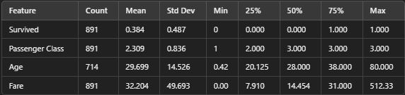

## **Titanic: The Voyage, The Tragedy, and The Story Behind the Data**

### **Introduction to the Titanic and Its Features**
The RMS Titanic was a marvel of early 20th-century engineering, hailed as the largest and most luxurious passenger liner of its time. Built by Harland and Wolff in Belfast, the Titanic measured approximately 882 feet in length and featured a gross tonnage of 46,328. With its elegant interiors, grand staircase, first-class lounges, and cutting-edge technology for the era, it catered to both the wealthy elite and emigrants seeking a new life in America.  
- **Ticket Costs**: Prices for tickets varied widely:
  - First-class fares ranged from £30 to £870 (approximately $3,000 to $100,000 today).
  - Third-class tickets cost around £7 ($700 today), making it accessible for many emigrants.  

### **Departure, Destination, and Stops**
The Titanic set sail from Southampton, England, on April 10, 1912, bound for New York City. Along the way, it made stops at Cherbourg, France, and Queenstown (now Cobh), Ireland, to pick up additional passengers. Tragically, the voyage was cut short when the Titanic struck an iceberg in the North Atlantic on April 14, 1912, sinking early the next morning and claiming over 1,500 lives.

---

### **The Legacy of the Titanic Movie**
James Cameron's 1997 film *Titanic* introduced a new generation to the tragedy. The movie, set against the backdrop of the disaster, focused on the fictional love story of Jack Dawson and Rose DeWitt Bukater.  
- **Cinematic Achievement**:  
  The film was a box-office success, winning 11 Academy Awards, including Best Picture.  
- **The Focus on Jack and Rose**:  
  Their romance symbolized a bridge between the class divide, highlighting the human aspect of the tragedy.  

While captivating, the movie's focus on Jack and Rose has overshadowed other significant aspects of the Titanic's story.

---

### **Looking Beyond Jack and Rose**
The Titanic story extends beyond the fictional couple, as evidenced by the data collected on its passengers. The dataset reveals insights into survival rates, class divides, and human behaviors under duress.

#### **Passenger Demographics**  
The Titanic dataset offers the following breakdown:

Key Observations:  
1. **Survival Rates**: Only 38.3% of passengers survived.  
2. **Class Influence**: Passengers in higher classes had better survival chances.  
3. **Age Distribution**: The majority of passengers were young adults.  

---

### **Survival and Gender**
Approximately 75% of survivors were women, underscoring the "women and children first" protocol.  
#### Discussion:  
The age distribution emphasizes the aspirations of youthful travelers. Many were emigrants or adventurers seeking opportunities in America.

---

### **Impact of Traveling Alone**
Survival chances varied based on companionship:  
- **With Company**: 47.7% survived.  
- **Alone**: 52.3% survived.  

#### Discussion:  
The data tells poignant stories of passengers traveling alone or with loved ones. In a time of chaos, choices about staying together or prioritizing survival may have determined outcomes.

---

### **Conclusion**
The Titanic's legacy is a multifaceted story of ambition, tragedy, and human resilience. While Hollywood brought the emotional story of Jack and Rose to life, the real data underscores the broader narratives of social class, age, and human choices that shaped the outcomes of that fateful night.